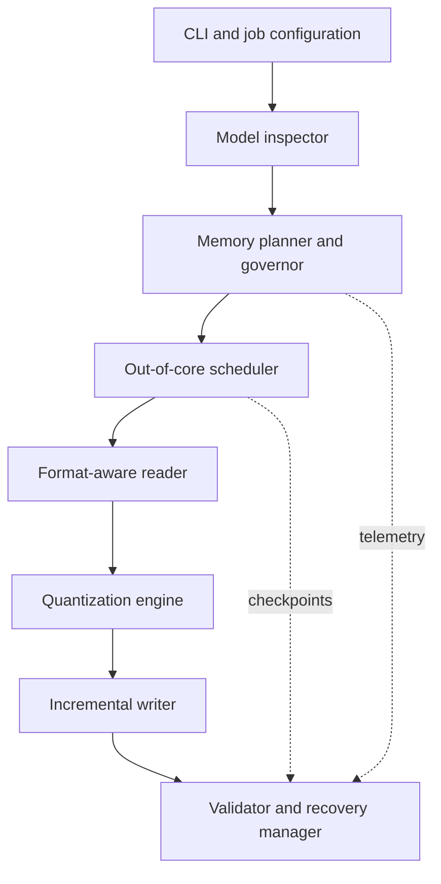

# FeatherQuant

## Agent-Ready Project Description and Brainstorming Brief

**Working title:** FeatherQuant: Memory-Bounded Out-of-Core Quantization of Large Language Models
**Tagline:** Quantize models larger than your RAM.
**Project type:** Systems research + open-source engineering
**Current stage:** Research framing and architecture exploration; no FeatherQuant implementation yet

---

## 1. Instructions to the Agent

You are helping brainstorm and design **FeatherQuant**, a system that allows users to quantize a large language model even when the original model is larger than the available system RAM.

Treat this document as the complete starting context. Analyze the idea critically instead of assuming every proposed contribution is novel or feasible. Clearly distinguish:

* what is already established in prior work;
* what is a practical engineering gap;
* what may constitute a defensible research contribution;
* what must be experimentally validated;
* and what should be included in the smallest useful prototype.

Do not claim that layer-wise quantization, lazy tensor loading, chunked processing, memory mapping, CPU offloading, or disk offloading are individually novel. They already exist. The potential contribution of FeatherQuant is the design and evaluation of an end-to-end quantization system whose central execution contract is a **user-defined peak-RAM budget**, particularly when that budget is far smaller than the source model.

Your job is to help refine the research gap, identify the most credible contribution, design the minimum viable architecture, expose hidden failure modes, and propose experiments that could support or falsify the main hypothesis.

---

## 2. Executive Summary

FeatherQuant is a proposed open-source framework for **memory-bounded, out-of-core LLM quantization**.

Most popular quantization workflows expect enough CPU RAM, GPU VRAM, or combined memory to materialize the complete model or large model components. This becomes a barrier when a user owns a model whose full-precision weights are larger than their available RAM. The user may be able to run the final quantized model, yet still be unable to create that quantized representation locally.

FeatherQuant aims to separate those two requirements.

Given:

* a source model of size `S`;
* a configurable memory budget `B`, where `B < S`;
* sufficient secondary storage;
* a supported source format and architecture;
* and a target quantization format;

the system will inspect model metadata without constructing the full model, read one memory-safe tensor region at a time, quantize it, immediately write the result, release its working buffers, and continue until it produces a valid inference-compatible model.

If an individual tensor is too large for the budget, the system must divide it along valid quantization boundaries into smaller row, column, group, or super-block ranges. Block size should be selected from an explicit memory model and adjusted using observed memory use.

The project optimizes first for **feasibility, bounded memory, correctness, reproducibility, and recoverability**. It does not claim that low-memory quantization will be faster. The expected trade-off is lower RAM in exchange for greater disk I/O and longer execution time.

The long-term user experience is:

```bash
featherquant quantize \
  --model ./source-model \
  --output ./model-q4_k_m.gguf \
  --format q4_k_m \
  --max-ram 2GB \
  --temp-dir ./featherquant-cache
```

The user should not need to calculate tensor sizes, split model shards manually, configure swap, or rent a high-memory machine.

---

## 3. Core Problem

Quantized models require much less memory for inference than their FP16 or BF16 sources, but creating them may still require enough memory to load the high-precision source.

For example, a user may have:

```text
Source model:       20 GB BF16
Available RAM:       2 GB
Target model:       ~5 GB 4-bit
Available disk:     50 GB
```

The desired operation is possible in principle if the quantizer's active working set is based on the current tensor block rather than the complete source model. In practice, existing tools may load the complete model, create hidden copies during conversion, hold large calibration data, or require output assembly structures that exceed the available memory.

This is not merely an inference-offloading problem. FeatherQuant focuses on the **model transformation process itself**: producing a quantized artifact from a high-precision source under a strict memory constraint.

### Why users need this

* The desired quantization type may not have been published.
* A private or newly fine-tuned model may have no public quantized version.
* The user may want a specific group size, mixed-precision policy, importance matrix, or hardware-compatible format.
* Third-party conversion parameters, calibration data, or tool versions may be unknown.
* Uploading a private model to a cloud machine may be unacceptable.
* Renting a high-memory server adds cost and operational friction.
* Reproducible research requires control of the exact source, algorithm, parameters, and toolchain.

---

## 4. Formal Objective and Memory Contract

Let:

* `S` = source model size on disk;
* `M` = physical system RAM;
* `B` = configured maximum memory budget for FeatherQuant;
* `D` = available secondary storage;
* `P(t)` = process resident memory at time `t`;
* `Q` = completed quantized model.

The target operating condition is:

```text
B <= M < S
```

The intended execution property is:

```text
max(P(t)) <= B
```

However, the precise claim must be designed carefully. A Python process cannot automatically control every allocator, library copy, page-cache effect, operating-system process, or sampling race. The research should therefore distinguish among:

1. **Planner estimate:** predicted active memory stays below `B`.
2. **Observed process bound:** measured RSS/PSS stays below `B` with stated measurement precision.
3. **Externally enforced bound:** the complete job succeeds inside a cgroup, container, Job Object, or equivalent hard memory ceiling.
4. **Whole-system requirement:** the computer remains usable and does not depend on uncontrolled swap growth.

A defensible experimental claim could be:

> FeatherQuant completes the conversion inside an externally enforced memory limit while its measured peak resident set remains below the configured application budget and the output matches the reference quantization within the defined correctness tolerance.

The planner may model the working set as:

```text
fixed runtime
+ input block
+ dequantization/casting buffer
+ quantizer scratch space
+ scales and metadata
+ packed output block
+ calibration state, if any
+ safety reserve
<= configured budget
```

There will always be a **minimum feasible budget** determined by fixed runtime overhead and the smallest valid quantization unit. FeatherQuant should detect and report this limit rather than promise operation under an impossible budget.

---

## 5. Main Hypotheses

### Primary hypothesis

Weight-only LLM quantization can be completed with peak RAM determined primarily by the largest active processing block and its temporary buffers, rather than by the total source-model size.

### Secondary hypotheses

* A budget-aware adaptive scheduler can stay closer to a configured memory ceiling than fixed tensor-wise or fixed-block processing.
* When block boundaries align with the quantizer's mathematical units, streaming the same deterministic weight-only algorithm should not introduce additional model-quality loss compared with conventional in-memory execution.
* Calibration-aware methods can eventually be made memory-bounded using sequential propagation, sufficient statistics, recomputation, compression, or disk-backed activation storage.
* Checkpointing at tensor or block granularity can make multi-hour, disk-heavy quantization reliable on ordinary computers.

### Expected trade-off

```text
Lower RAM budget
    -> smaller blocks
    -> more scheduler and I/O operations
    -> potentially more temporary storage
    -> longer quantization time
```

The first research objective is not speed. It is to determine whether the transformation can be made **possible, correct, bounded, and reproducible**.

---

## 6. Current Technical Landscape and Research Positioning

The project must be positioned conservatively.

* [GPTQ](https://arxiv.org/abs/2210.17323) established accurate one-shot weight quantization using approximate second-order information.
* [AWQ](https://arxiv.org/abs/2306.00978) uses activation statistics to identify and protect salient weight channels.
* [Safetensors](https://huggingface.co/docs/safetensors/index) exposes metadata and partial tensor access through `safe_open` and `get_slice`, making it a promising source format for selective reads.
* The current [llama.cpp quantization documentation](https://github.com/ggml-org/llama.cpp/tree/master/tools/quantize) states that larger models are fully loaded into memory during quantization and require sufficient RAM. This identifies a concrete practical gap in a widely used local quantization workflow.
* [ELUTQ](https://arxiv.org/html/2510.19482v2) already demonstrates lazy block loading, chunked quantizer computations, and disk-backed hidden states, including quantization of LLaMA 3.1 70B with reduced CPU memory. Therefore, lazy loading and disk offloading cannot be presented as FeatherQuant's core novelty.

### Candidate research contribution

The strongest current positioning is:

> FeatherQuant is a general memory-governed quantization runtime that treats a user-defined peak-RAM budget as a first-class execution contract and coordinates source slicing, valid quantization units, adaptive scheduling, incremental compatible output, monitoring, and recovery under that contract.

Possible differentiators that must be verified through a broader literature review are:

* arbitrary or widely configurable RAM budgets rather than a fixed hardware recipe;
* recursive processing below the transformer-block or tensor level;
* explicit planning for all temporary buffers and hidden copies;
* adaptive block sizing based on live memory feedback;
* an externally testable memory-bound contract;
* format-aware incremental writing of a directly usable artifact;
* deterministic resume after interruption;
* and a benchmark focused on source-model-size-to-RAM ratios, not only absolute RAM or VRAM.

The paper should be framed as a **systems contribution**, unless later work introduces a genuinely new quantization algorithm.

---

## 7. Intended Users and Use Cases

### Primary users

* developers with limited-RAM desktops or laptops;
* researchers reproducing quantization experiments;
* users quantizing private fine-tuned models;
* open-source maintainers producing uncommon model variants;
* edge and offline users who have sufficient storage but limited memory;
* and educators studying quantization on commodity hardware.

### Main use cases

1. Convert a model whose source weights are larger than physical RAM.
2. Generate an uncommon GGUF variant that is unavailable publicly.
3. Quantize a private model without uploading it to a cloud provider.
4. Reproduce the exact same quantization using a declared memory budget and manifest.
5. Resume a conversion after a crash, shutdown, or insufficient-disk event.
6. Benchmark the relationship among RAM, time, I/O, temporary storage, and output quality.

---

## 8. Proposed Architecture



### 8.1 CLI and job configuration

Accept:

* source model or shard index;
* target output path and format;
* quantization type;
* maximum RAM;
* safety reserve;
* temporary directory;
* worker count;
* optional calibration data or importance matrix;
* resume policy;
* and validation level.

### 8.2 Model inspector

Read without materializing the neural network:

* model configuration and architecture;
* tokenizer and metadata;
* tensor names, shapes, data types, byte ranges, and shard locations;
* weight tying and aliases;
* output tensor rules;
* target quantization policy per tensor;
* and the required output layout.

The inspector should produce an immutable job plan or manifest.

### 8.3 Memory planner and governor

Responsibilities:

* establish fixed runtime overhead;
* reserve operating headroom;
* estimate input, scratch, metadata, and output buffers;
* choose the largest safe processing unit;
* monitor actual memory;
* reduce future block sizes when actual use exceeds prediction;
* prevent new work from starting near the ceiling;
* and fail safely when the minimum valid unit cannot fit.

The first implementation should use one quantization worker. Concurrency complicates the memory bound and is an optimization for later versions.

### 8.4 Format-aware reader

The reader maps a logical tensor block to an exact disk region. It should prefer sequential, aligned reads and avoid library operations that silently copy or materialize a complete tensor.

Potential inputs:

* high-precision GGUF for the smallest initial scope;
* sharded Safetensors for the eventual end-to-end Hugging Face workflow;
* F16 and BF16 initially, with F32 optional.

### 8.5 Out-of-core scheduler

The scheduler selects work in this hierarchy:

```text
model
  -> shard or source file
    -> tensor
      -> row/column range
        -> quantization group or super-block
```

Conceptual loop:

```text
inspect model and precompute output layout
for each output tensor in deterministic order:
    determine its target quantization type
    determine the largest valid block fitting the current budget
    read only that source region
    transform and quantize it
    write the packed output at the planned offset
    flush and checksum the block
    update the recovery manifest atomically
    release or reuse all buffers
validate the completed artifact
```

Block boundaries must respect the algorithm and output representation. For GGUF K-quants or I-quants, arbitrary byte slicing is not valid; work must align with the quantizer's group and super-block requirements.

### 8.6 Quantization engine

Start with deterministic weight-only quantization:

* reference symmetric RTN on isolated tensors for the earliest proof;
* one practical GGUF type for the first usable model;
* then Q8_0 and a representative K-quant such as Q4_K_M or its underlying tensor types;
* importance-matrix or calibration-aware modes only after the memory-bound base path is stable.

The system is initially a scheduler/runtime around an existing quantization definition, not a new numerical quantizer.

### 8.7 Incremental writer

The writer must produce a valid, loadable artifact without retaining all quantized tensors.

It must preserve:

* global metadata;
* tensor names, types, shapes, order, and alignment;
* precomputed tensor offsets;
* quantization scales and packed values;
* tokenizer and architecture metadata;
* mixed tensor types required by model-level presets;
* shard information if output sharding is supported;
* and checksums or validation metadata outside the final model when necessary.

Possible designs:

1. Precompute all output tensor sizes and offsets, write the header, and stream blocks directly to final positions.
2. Reserve header space and patch it during a final assembly pass.
3. Write tensor fragments to temporary files and assemble them using a low-memory sequential pass.
4. Preserve output shards so no single final file operation becomes a bottleneck.

### 8.8 Recovery manager

Maintain an atomic sidecar manifest containing:

* source identity and checksums;
* tool and quantizer version;
* complete configuration;
* output layout;
* completed tensors or blocks;
* block hashes and output offsets;
* temporary files;
* memory-planner decisions;
* and job status.

On resume, verify all committed blocks before continuing. Never treat a partially written model as complete.

### 8.9 Validator

Validation levels may include:

* structural GGUF or output-format validation;
* tensor count, shape, type, offset, and checksum checks;
* successful model load in the target runtime;
* deterministic inference smoke test;
* tensor-level comparison with a conventional quantizer;
* perplexity and task-quality evaluation;
* and repeat-run determinism.

---

## 9. Critical Engineering Questions

These questions may determine the viability and exact scope of the first prototype.

### Input-path question

Should version 1 accept:

* BF16/F16 GGUF and perform only the quantization step; or
* sharded Safetensors and perform conversion plus quantization end to end?

**Recommended research sequence:** begin with high-precision GGUF to isolate and compare the quantization step against `llama-quantize`, then add a streaming Safetensors-to-GGUF front end. The eventual user goal requires the second path because a memory-heavy conversion stage would otherwise preserve the original barrier.

### Partial tensor access

* Does the chosen library truly read only requested bytes?
* Which slice directions are contiguous?
* Does BF16 conversion create a full-sized copy?
* Can memory mapping inflate RSS unpredictably through page faults?
* Would a small C/Rust/C++ reader provide more predictable memory than PyTorch?

### Numerical equivalence

* Can a tensor quantized in independent valid blocks produce byte-identical output to the reference implementation?
* Which quantizers require statistics over a full row, tensor, layer, or calibration set?
* What is the minimal mathematical dependency unit for each supported quantization type?
* If a first pass is needed for statistics and a second pass for packing, what are its I/O and memory costs?

### Output generation

* Can every output offset and length be computed from metadata before the data is quantized?
* How should mixed model-level types such as `Q4_K_M` be resolved per tensor?
* Can direct random-position writes remain crash-safe?
* Is sharded GGUF a better first output for constrained systems?

### Memory enforcement

* Should `--max-ram` refer to process RSS, proportional set size, container usage, or all FeatherQuant child processes?
* How much safety reserve is needed?
* How can allocator fragmentation and delayed garbage collection be bounded?
* Should the production core use fixed reusable buffers and avoid general-purpose tensor frameworks?
* How should Windows and Linux enforce and measure the same contract?

### Storage behavior

* What is the maximum temporary-space amplification?
* Can processing order make reads mostly sequential?
* At what block size does HDD random I/O become impractical?
* Can asynchronous prefetching be added without violating the RAM budget?

---

## 10. Recommended Scope

### Minimum research prototype

* CPU-only.
* Linux first.
* Single process and single worker.
* Dense Llama-compatible architecture.
* F16/BF16 high-precision GGUF input.
* One simple quantization type initially.
* Tensor and valid sub-tensor streaming.
* Configurable memory budget.
* Fixed reusable buffers where possible.
* Incremental GGUF output.
* Peak-memory measurement.
* External memory-limit testing.
* Structural validation and inference smoke test.

### First useful release

* Sharded Safetensors input.
* One or more Llama/Qwen-compatible architectures.
* Q8_0 plus one representative 4-bit GGUF path.
* Adaptive block sizing.
* Atomic checkpoints and resume.
* Accurate disk-space preflight.
* Reproducible job manifest.
* Baseline comparison with current llama.cpp.

### Explicitly out of initial scope

* training and fine-tuning;
* quantization-aware training;
* every GGUF type;
* all transformer architectures;
* multimodal models;
* distributed execution;
* GPU acceleration;
* full GPTQ/AWQ reproduction;
* optimal performance on HDDs;
* or a universal guarantee for arbitrarily tiny RAM budgets.

---

## 11. Development and Research Roadmap

### Phase 0 — Establish the baseline

* Pin the llama.cpp revision and quantization parameters.
* Record conventional peak RSS, runtime, output hash, output size, and quality.
* Identify exactly where complete-model allocation occurs.
* Define the target model and one quantization type.

### Phase 1 — Synthetic tensor proof

* Generate a tensor larger than the allowed process memory.
* Read it in aligned slices.
* perform deterministic RTN quantization;
* write packed blocks incrementally;
* compare against an unrestricted reference;
* and prove completion inside an external memory ceiling.

This phase validates memory-bounded tensor transformation, not a complete LLM.

### Phase 2 — Valid complete model

* Parse high-precision GGUF metadata.
* Precompute target tensor types and output offsets.
* Stream and quantize every supported tensor.
* Copy unsupported/non-quantized tensors safely.
* Produce a model accepted by llama.cpp.
* Compare tensors and inference with the reference output.

### Phase 3 — Adaptive memory controller

* Model all buffers.
* Add live RSS/PSS monitoring.
* Adjust block sizes between work units.
* add a safety reserve and emergency stop;
* and characterize prediction error.

### Phase 4 — Reliability

* Add an atomic manifest, block checksums, resume, and safe temporary naming.
* Test forced termination at random points.
* Test corrupted fragments and source changes.
* Test insufficient disk space and read errors.

### Phase 5 — End-to-end source support

* Read sharded Safetensors metadata and slices.
* Stream architecture mapping and metadata conversion.
* Avoid a full-precision intermediate GGUF where possible.
* If a temporary GGUF is required, quantify its storage cost and keep the process memory-bounded.

### Phase 6 — Calibration-aware extension

Evaluate:

1. disk-backed activations;
2. sequential layer propagation;
3. compressed sufficient statistics;
4. activation recomputation;
5. disk-backed importance matrices.

Only pursue this after the deterministic weight-only path is correct.

---

## 12. Experimental Design

### Independent variables

#### Source-model-to-budget ratio

* source smaller than budget;
* approximately `1x` budget;
* `2x` budget;
* `5x` budget;
* `10x` budget;
* and, if practical, greater than `10x`.

#### RAM budget

* 1 GB;
* 2 GB;
* 4 GB;
* 8 GB;
* unrestricted baseline.

Budgets must be adjusted when the runtime's fixed overhead makes a level impossible.

#### Scheduling strategy

* conventional in-memory;
* operating-system swap;
* one tensor at a time;
* fixed-size blocks;
* FeatherQuant adaptive blocks;
* FeatherQuant without prefetch;
* FeatherQuant with budget-aware prefetch later.

#### Storage device

* HDD;
* SATA SSD;
* NVMe SSD.

#### Quantization configuration

* simple 8-bit symmetric reference;
* GGUF Q8_0;
* one 4-bit K-quant path;
* optional importance-aware configuration later.

### Evaluation metrics

#### Feasibility and correctness

* conversion completed;
* output opened successfully;
* inference completed;
* tensor structure matches reference;
* block-wise versus in-memory numerical or byte equivalence;
* recovery succeeded after interruption.

#### Memory

* peak RSS and PSS;
* cgroup/container peak usage;
* estimated versus measured memory;
* count and magnitude of budget violations;
* page faults and swap use;
* minimum successful budget.

#### Performance and I/O

* wall-clock quantization time;
* bytes read and written;
* I/O operation count;
* read/write throughput;
* CPU utilization;
* block-size distribution;
* temporary storage peak;
* overhead relative to unrestricted reference.

#### Model result

* final size and effective bits per weight;
* perplexity difference;
* selected downstream-task accuracy;
* layer or tensor reconstruction error;
* output similarity and deterministic test prompts.

#### Reliability

* correct resume point;
* repeated-run hash consistency;
* behavior after forced termination;
* behavior with insufficient disk;
* behavior with corrupt or changed source shards.

---

## 13. Baselines

Compare FeatherQuant with:

1. current conventional `llama-quantize` execution;
2. the same conventional tool using OS swap;
3. a naive tensor-at-a-time implementation;
4. a fixed-block streaming implementation;
5. FeatherQuant with adaptive scheduling disabled;
6. manual shard processing if a valid workflow exists;
7. calibration-aware tools such as GPTQ/AWQ only where hardware and scope permit.

The main success comparison is not simply speed. A slower run is still valuable if it completes correctly under a memory limit where the baseline cannot complete.

---

## 14. Success Criteria

The first end-to-end result is successful if FeatherQuant can:

1. quantize a source model larger than the available/enforced RAM;
2. finish inside the declared external memory ceiling;
3. process an individual tensor that is larger than its working budget;
4. produce a valid model loadable by the target runtime;
5. match the unrestricted reference quantization within the defined tolerance;
6. recover correctly from forced interruption;
7. demonstrate a predictable RAM-versus-runtime/I/O trade-off;
8. and provide a reproducible manifest and benchmark report.

A strong demonstration target is:

```text
Source:                 ~20 GB BF16 model
Configured budget:       2 GB
Execution:               CPU-only commodity machine
Target:                  usable 4-bit GGUF
Peak memory:             inside enforced limit
Quality:                 comparable to reference quantization
Recovery:                successful after forced interruption
```

The `10x` source-size-to-memory ratio is a research target, not a promise before implementation.

---

## 15. Existing Groundwork

The project owner has already built and used a reproducible llama.cpp workflow for:

* downloading a Hugging Face model;
* converting it to BF16 GGUF;
* generating multiple GGUF variants;
* benchmarking prompt processing and token generation;
* measuring output sizes;
* and planning perplexity and quality evaluation.

The existing test model is Qwen3-0.6B, with experience across BF16, Q8_0, Q6_K, Q5_K_M, Q4_K_M, Q3_K_M, Q2_K, Q1_0, IQ3_M/IQ3_S, and IQ4_NL/IQ4_XS. This work is useful as the conventional baseline and validation pipeline, but it is not yet evidence that FeatherQuant's memory-bounded approach works.

Available development hardware includes a high-memory CPU workstation and an RTX 5070 Ti. Low-memory conditions can initially be emulated using containers or cgroups with hard limits, followed by validation on an actual low-memory system if available.

---

## 16. Major Risks

### Risk: the apparent novelty already exists

Strict budget-aware quantization may already appear in a recent system or unpublished implementation.

**Response:** conduct a structured literature and code review before finalizing the paper claim. Search systems venues, arXiv, quantization repositories, issues, and conversion tools. Compare explicit guarantees, processing granularity, output compatibility, recovery, and experiments rather than keywords alone.

### Risk: hidden memory copies break the budget

PyTorch, NumPy, casting, reshaping, serialization, and memory mapping may create or retain unexpected pages and copies.

**Response:** isolate each operation in subprocess memory tests, reuse fixed buffers, prefer explicit low-level kernels when necessary, and validate under an external memory cap.

### Risk: the smallest valid quantization unit is too large

Some algorithms may require full rows, matrices, Hessian blocks, or activations.

**Response:** document a minimum required budget per algorithm; begin with a quantizer whose dependencies are local; use two-pass statistics where possible; do not claim universal support.

### Risk: output format prevents true streaming

Headers and offsets may be needed before tensor data is written.

**Response:** precompute encoded sizes, use direct offset writes, reserve metadata space, preserve shards, or perform a low-memory final assembly pass.

### Risk: tiny blocks make disk behavior unusable

The system may technically succeed but require excessive random I/O.

**Response:** process in source-file order where possible, coalesce reads, benchmark multiple storage tiers, and expose an honest time/storage estimate before execution.

### Risk: a “hard guarantee” is overstated

RSS sampling alone cannot prove that no instantaneous spike occurred.

**Response:** combine internal telemetry with OS-enforced limits and state the guarantee precisely.

### Risk: scope becomes too broad

Supporting Safetensors conversion, every architecture, multiple quantizers, GGUF packing, GPU execution, calibration, and recovery together would stall the project.

**Response:** prove one complete CPU-only path first and generalize only after correctness and memory control are demonstrated.

---

## 17. Expected Outputs

### Engineering outputs

* a working CLI prototype;
* a memory planner and adaptive scheduler;
* one supported input-to-output path;
* an incremental writer;
* checkpoint/resume support;
* validation and benchmark scripts;
* machine-readable job manifests;
* and reproducible experiment results.

### Research outputs

* a precise memory-bounded quantization model;
* characterization of minimum feasible working sets;
* comparison of fixed and adaptive scheduling;
* analysis of RAM, I/O, runtime, and quality trade-offs;
* failure-mode and recovery evaluation;
* and a defensible statement of where FeatherQuant improves on existing workflows.

---

## 18. Questions the Brainstorming Agent Must Answer

Return a structured analysis addressing all of the following:

1. **Research gap:** What exact claim is both useful and plausibly novel after considering GPTQ, AWQ, ELUTQ, llama.cpp, Safetensors, and other relevant work?
2. **Novelty threats:** Which papers, repositories, or tools are closest to this exact idea?
3. **MVP path:** Should the first implementation be GGUF-to-GGUF or Safetensors-to-GGUF, and why?
4. **Quantization type:** Which single quantization type is easiest and most scientifically useful for the first compatible prototype?
5. **Memory model:** How should FeatherQuant estimate, monitor, and enforce its budget?
6. **Processing unit:** What is the smallest valid unit for the chosen quantizer and format?
7. **Output writer:** How can the selected format be written incrementally and recovered safely?
8. **Equivalence:** How should streamed output be compared against conventional output?
9. **Experiments:** What is the smallest experiment matrix that can validate the main hypothesis without becoming too expensive?
10. **Failure conditions:** Under what budgets, tensor shapes, formats, algorithms, and storage devices will the idea fail or become impractical?
11. **Implementation language:** Which parts should remain in Python and which require C, C++, or Rust?
12. **Research paper:** What would the strongest paper contribution, evaluation story, and title be?
13. **Twelve-week plan:** Propose weekly milestones with a go/no-go checkpoint after the earliest meaningful proof.

For every recommendation, label it as one of:

* **Known from sources**
* **Engineering inference**
* **Research hypothesis**
* **Requires experiment**

End with:

* the recommended MVP specification;
* the top five technical risks;
* the first three experiments;
* the most defensible novelty statement;
* and a list of claims FeatherQuant must not make yet.

---

## 19. One-Sentence Description

> FeatherQuant is an open-source, memory-governed quantization system that aims to transform language models larger than available RAM into usable low-bit artifacts through format-aware sub-tensor streaming, adaptive scheduling, incremental output, and resumable execution.

## 20. Short Pitch

Today, a low-memory device may be capable of running a quantized model but incapable of producing that quantized model from its original weights. FeatherQuant investigates whether the conversion itself can be made out-of-core and governed by an explicit RAM budget. It spends additional time and disk I/O so users can quantize private, new, or uncommon models locally without requiring memory proportional to the original model size.

## 21. Final Vision

```text
Give FeatherQuant a model.
Choose the target representation.
Set the maximum memory it may use.
Let the system plan, stream, quantize, validate, and recover automatically.
```

FeatherQuant does not attempt to eliminate the cost of quantization. It aims to move that cost away from inaccessible memory capacity and toward manageable execution time and secondary storage, making independent model ownership and experimentation possible on a wider range of hardware.

